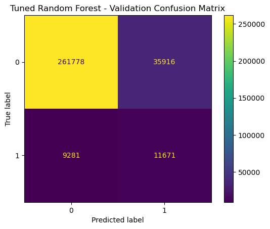
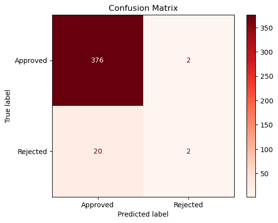
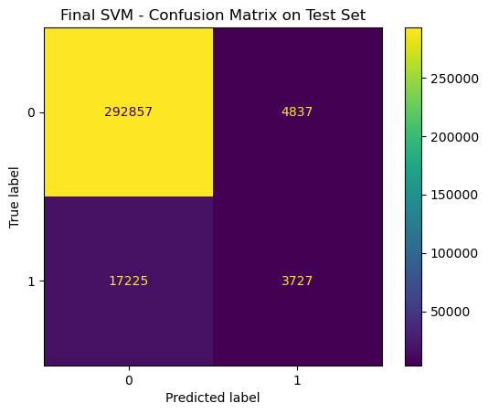
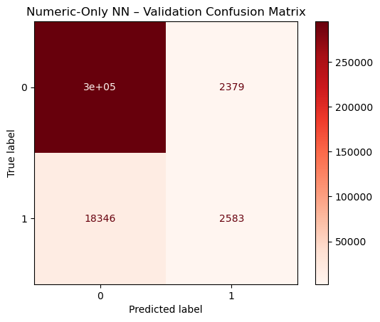

# 🔍 Toxic Comment Analysis
DS 4021: Machine Learning II Final Project

Dongju Han, Kayla Kim, Mason Nicoletti

## 🧾 Introduction:

Social media harm is a pervasive issue, driven by the rapid spread of toxic comments, hate speech, and polarized discourse across online platforms. As part of Data Project 3, the team collected and analyzed large-scale Bluesky Firehose data, accessible in the project repository under the skyblue directory: [Skyblue Directory](https://github.com/djhan0330/ds3022-data-project-3/tree/main/skyblue)


Through this exploratory analysis, the team identified patterns and linguistic features indicative of harmful online content. To study these patterns rigorously, the project applies a range of machine-learning methods for sentiment and toxicity classification, including Support Vector Machines (SVM), logistic regression, ensemble methods such as Random Forest, and neural networks. By comparing the performance of these models, the analysis aims to provide deeper insight into how toxic speech manifests within social media data and which approaches are most effective at detecting harmful content at scale.

## 🛠️ Software and Platform Requirements

To run the notebooks and scripts in this project, you will need:
* pandas>=2.0
* numpy>=1.26
* scikit-learn>=1.4
* scipy>=1.10
* matplotlib>=3.8
* seaborn>=0.13
* wordcloud>=1.9
* tqdm>=4.66
* torch (Only for Neural Network)

A full dependency list is provided in requirements.txt

## 📁 Repository Structure 

Below is an outline of the folders and files in this repository to help users quickly understand the organization:

```text
toxic-comment-analysis/
├── data/
│   ├── test_link.txt                     # Link to the testing dataset in Google Drive
│   ├── train.csv.zip                     # Training dataset (80% of full data)
│   └── test.csv.zip                      # Testing dataset (20% of full data)
│
├── notebooks/
│   ├── descriptive_analysis.ipynb          # Exploratory data analysis on raw/cleaned data
│   ├── svm.ipynb                           # SVM sentiment model
│   ├── nn_toxic_comment_classifier.ipynb   # Neural network sentiment model
│   ├── regression.ipynb                    # Logistic regression model
│   ├── ensemble.ipynb                      # Random forest / ensemble model
│   └── test_best_model.ipynb               # Evaluation of the best-performing model
│
├── output/
│   ├── comment-numeric-ensemble-confusionmatrix.png     # Confusion matrix for ensemble model
│   ├── comment-numeric-regression-confusionmatrix.png   # Confusion matrix for logistic regression
│   ├── comment-numeric-svm-confusionmatrix.png          # Confusion matrix for SVM model
│   ├── mean_toxicity_by_class.csv                       # Average toxicity score by class
│   ├── numeric-nn-confusionmatrix.png                   # Confusion matrix for neural network model
│   ├── toxicity_distribution_by_class.png               # Toxicity distribution by label
│   ├── word_char_hist.png                               # Word/character count histogram
│   ├── wordcloud_non_toxic.png                          # Word cloud for non-toxic comments
│   └── wordcloud_toxic.png                              # Word cloud for toxic comments
│ 
├── scripts/
│   ├── data_cleaning.py                # Data cleaning (NA removal, deduplication, encoding)
│   ├── eda_cleaned_data.ipynb          # EDA on cleaned dataset
│   └── eda_raw_data.ipynb              # EDA on raw dataset
│
├── .gitignore                          # Files and folders excluded from version control
├── requirements.txt                    # Project dependencies
└── README.md                           # Project description and documentation
```

## 🗃️ Dataset Description: 
This project uses the Jigsaw Unintended Bias in Toxicity Classification dataset, a large-scale public dataset released on Kaggle. The dataset was originally created to support research on toxic language detection while emphasizing fairness, unintended bias, and the social implications of toxic language models. The link for the dataset is accessible using this link: [Jigsaw Unintended Bias in Toxicity Classification Dataset](https://www.kaggle.com/competitions/jigsaw-unintended-bias-in-toxicity-classification/data)

The dataset contains:
* A large corpus of user-generated comments from online discussion platforms
* A continuous toxicity score ranging from 0 to 1
* Several auxiliary toxicity indicators, such as:
    * severe_toxicity
    * insult
    * threat
    * obscene
    * identity_attack
* A rich set of identity attributes (e.g., gender, race, religion) used to study model bias

For this project, toxicity labels were derived from the binary rating field:
* rejected → comment flagged or removed due to toxic or inappropriate content
* approved or other statuses → acceptable / non-toxic comment

This rating was used to define the binary classification target:
* Toxic: rating = "rejected"
* Non-toxic: all other cases

## 🧩 Features Used

Unlike approaches that rely solely on text data, this project incorporated both textual and numeric features:

1: Text Features
* Raw comment text
* Transformed using TF-IDF vectorization (with max_features = 2000)

2: Numeric Features
* Continuous toxicity score
* Auxiliary toxicity indicators (e.g., insult, obscene, identity_attack, etc.)
* These features enriched the model by providing additional context beyond language alone

By combining text-derived embeddings with structured numeric variables, the models were able to learn both linguistic patterns and quantitative signals of toxicity.

After preprocessing (removing nulls, duplicates, and empty comments), the resulting dataset contained approximately 1,593,229 samples, with a naturally imbalanced label distribution in which non-toxic comments are more common than toxic ones.

## 🤖 Model Overview

We evaluated four machine learning models for toxic comment classification:

* Logistic Regression (baseline linear model)
* Support Vector Machine (SVM)
* Ensemble Model (Random Forest)
* Neural Network (dense feed-forward classifier)

Models were trained using:
- TF-IDF text embeddings (max_features = 2000)
- Embeddings in Neural Network
- Numeric toxicity indicators (insult, obscene, identity_attack, etc.)

The goal was to compare classical ML approaches with neural models on the same feature space.

## 📊 Model Performance (Confusion Matrices)

Below are the confusion matrices for each classifier:

| Model | Confusion Matrix |
|-------|------------------|
| **Ensemble Model** |  |
| **Logistic Regression** |  |
| **SVM** |  |
| **Neural Network** |  |

## 📝 Summary of Model Performance

Across all models, the primary objective was to minimize false negatives, since misclassifying a toxic comment as “safe” poses the greatest real-world risk. The confusion matrices reveal several key trends:

* Logistic Regression failed to identify any toxic samples in the validation set, predicting exclusively the majority (non-toxic) class. This highlights strong class imbalance sensitivity and makes it unsuitable for toxicity detection without resampling or class-weighting techniques.
* SVM and Neural Network models showed meaningful ability to capture toxic comments, with stronger true-positive rates and substantially fewer false negatives compared to logistic regression.
* The Ensemble Model (Random Forest) achieved the best overall balance, producing the lowest false-negative count among the tested models while still maintaining strong true-positive performance for the non-toxic class.

Overall, although all models performed reasonably well on non-toxic examples, the Random Forest model most effectively reduced false negatives, aligning with the project’s primary goal of reliably detecting harmful or unsafe comments.

## ✔️ Conclusion 

This project demonstrates how combining TF-IDF text features with numeric toxicity indicators can effectively support toxic comment classification. Among the evaluated models, the Random Forest ensemble achieved the best balance between sensitivity and accuracy, particularly in reducing false negatives—the most critical failure mode in safety-related moderation tasks.

Due to hardware and kernel limitations, the full dataset of nearly two million comments could not be processed directly; instead, a randomized subset was used to train and evaluate classical machine learning models. Even with this reduced sample, expressive models such as SVMs, neural networks, and ensembles consistently outperformed simpler linear approaches, highlighting the importance of richer features and higher-capacity models when detecting nuanced toxic language.

Overall, the results underscore the value of combining structured toxicity metadata with text-derived embeddings, and they point toward more advanced deep learning methods as promising future directions.

## ⚠️ Limitations

Although the project produced meaningful insights, several limitations should be noted:

* Computational Constraints:
    The original dataset contains nearly 2 million comments. Hardware and kernel memory limits prevented full-scale model training, requiring the use of a random subsample. This may reduce generalizability and   performance consistency.

* Model Capacity:
    Classical ML models (Logistic Regression, SVM, Random Forest) can struggle to capture contextual or semantic nuances inherent in toxic language. Transformer-based models (e.g., BERT) would likely perform significantly better.

* Class Imbalance:
    The dataset is naturally imbalanced, with non-toxic comments being far more common. Some models (especially Logistic Regression) collapsed into majority-class prediction without class-weighting or balancing methods.

* Bias and Ethical Considerations:
    The Jigsaw dataset includes sensitive identity attributes. Without fairness metrics, it is unclear how well models treat identity-related comments, and unintentional bias remains possible.

These limitations point to opportunities for improvement through more powerful language models, better hardware resources, and fairness-aware evaluation methods.